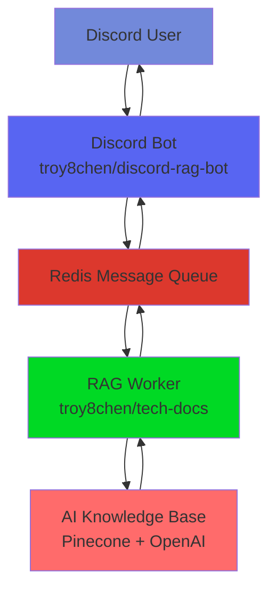

# Discord RAG Bot 🤖

> **AI-Powered Discord Bot with Expert Knowledge Base**  
> Production-ready Discord bot that connects to a RAG (Retrieval-Augmented Generation) service for intelligent document assistance. Powered by Redis event-driven architecture for scalable, real-time AI responses.

[](https://github.com/troy8chen/discord-rag-bot/actions)
[](https://github.com/troy8chen/discord-rag-bot/pkgs/container/discord-rag-bot)
[](https://www.typescriptlang.org/)
[](https://redis.io/)

## 🏗️ Architecture Overview

This Discord bot works with a **separate RAG service** to provide expert-level assistance:



### 🔄 Event-Driven Flow
1. **User sends message** → Discord bot receives interaction
2. **Bot publishes query** → Redis `rag:query` channel
3. **RAG worker processes** → AI generates expert response
4. **Worker publishes response** → Redis `rag:response` channel  
5. **Bot receives response** → Formatted Discord message sent

## 🚀 Quick Start

### Option 1: Test with Live Bot (Easiest)
Join our test Discord server to try the bot immediately:

**🔗 [Test Channel](https://discord.com/channels/1378047991264579745/1378047991910236214)**

- Bot: `DocsAI#6774`
- Use slash commands: `/ask`, `/help`
- No setup required - just join and test!
- Need permissions? Contact [@troy8chen](https://github.com/troy8chen)

### Option 2: Run Your Own Instance

#### 📋 Prerequisites
- Node.js 18+ 
- Docker (for Redis)
- Discord Developer Application
- OpenAI API Key
- Pinecone Account

#### 🔧 Repository Setup

```bash
# 1. Clone both repositories
git clone https://github.com/troy8chen/discord-rag-bot.git
git clone https://github.com/troy8chen/tech-docs.git

# 2. Setup RAG Service (tech-docs)
cd tech-docs
npm install
cp .env.example .env.local
# Configure: OPENAI_API_KEY, PINECONE_API_KEY, PINECONE_INDEX_NAME, REDIS_URL

# 3. Setup Discord Bot (discord-rag-bot)  
cd ../discord-rag-bot
npm install
cp .env.example .env
# Configure: DISCORD_BOT_TOKEN, DISCORD_CLIENT_ID, REDIS_URL
```

#### 🤖 Discord Bot Configuration

1. **Create Discord Application**
   - Go to [Discord Developer Portal](https://discord.com/developers/applications)
   - Click "New Application" → Name your bot
   - Navigate to "Bot" section → Reset Token (save this as `DISCORD_BOT_TOKEN`)
   - Copy Application ID (save this as `DISCORD_CLIENT_ID`)

2. **Configure Bot Permissions**
   ```
   Required Permissions:
   ✅ Send Messages
   ✅ Use Slash Commands  
   ✅ Read Message History
   ✅ Embed Links
   ✅ Add Reactions
   ```

3. **Invite Bot to Server**
   ```
   https://discord.com/api/oauth2/authorize?client_id=YOUR_CLIENT_ID&permissions=277025573888&scope=bot%20applications.commands
   ```
   Replace `YOUR_CLIENT_ID` with your actual client ID.

#### 🐳 Infrastructure Setup

```bash
# Start Redis (required for bot communication)
docker run -d --name redis -p 6379:6379 redis:7-alpine

# Verify Redis is running
docker exec redis redis-cli ping
# Should return: PONG
```

#### ▶️ Start Both Services

```bash
# Terminal 1: Start RAG Worker (tech-docs)
cd tech-docs
npm run rag-worker

# Expected output:
# ✅ All environment variables loaded
# ✅ Redis connected  
# 🤖 RAG worker started, listening for queries...

# Terminal 2: Start Discord Bot (discord-rag-bot)
cd discord-rag-bot  
npm run dev

# Expected output:
# ✅ Discord configuration loaded
# ✅ Redis connected successfully
# ✅ Bot logged in as: YourBot#1234
# 🎯 Discord RAG bot ready!
```

## 📚 Usage

### Slash Commands

| Command | Description | Example |
|---------|-------------|---------|
| `/ask <question>` | Ask any question about your knowledge base | `/ask How does rate limiting work?` |
| `/help` | Show available commands and bot info | `/help` |

### Example Interactions

```
User: /ask How do I implement error handling in my functions?

Bot: 🤖 **Expert Answer:**

Based on the documentation, here are the best practices for error handling:

1. **Use try-catch blocks** for synchronous errors
2. **Implement retry logic** with exponential backoff  
3. **Use step functions** to isolate error-prone operations
4. **Configure failure handling** in your function configuration

📚 **Sources:**
- [Error Handling Guide](https://example.com/docs/errors)
- [Retry Patterns](https://example.com/docs/retry)

*Response time: 1.2s*
```

## 🛠️ Configuration

### Environment Variables

#### Discord Bot (.env)
```env
# Discord Configuration
DISCORD_BOT_TOKEN=your_bot_token_here
DISCORD_CLIENT_ID=your_client_id_here

# Redis Configuration (must match RAG service)
REDIS_URL=redis://localhost:6379

# Optional Settings
LOG_LEVEL=info
NODE_ENV=development
```

#### RAG Service (tech-docs/.env.local)
```env
# AI Configuration
OPENAI_API_KEY=sk-your_openai_key_here
PINECONE_API_KEY=your_pinecone_key_here  
PINECONE_INDEX_NAME=tech-docs

# Redis Configuration (must match Discord bot)
REDIS_URL=redis://localhost:6379

# Optional
NEXT_PUBLIC_APP_URL=http://localhost:3000
```

### Performance Tuning

```env
# Discord Bot Performance
USER_RATE_LIMIT_PER_MINUTE=60       # Queries per user per minute
RESPONSE_TIMEOUT_MS=25000           # Max response wait time
MAX_CONCURRENT_REQUESTS=10          # Concurrent query limit

# RAG Worker Performance  
RAG_RESPONSE_TIMEOUT=30000          # AI processing timeout
VECTOR_SEARCH_LIMIT=5               # Number of knowledge chunks
SIMILARITY_THRESHOLD=0.4            # Relevance threshold
```

## 🚀 Deployment

### Option 1: Railway (Recommended)

#### Deploy RAG Service
```bash
cd tech-docs
# Connect to Railway and deploy
railway login
railway init
railway add --service
railway up
```

#### Deploy Discord Bot
```bash
cd discord-rag-bot  
railway login
railway init
railway add --service
railway up
```

#### Configure Environment Variables
- Set all required environment variables in Railway dashboard
- Ensure both services use the same Redis URL
- Use Railway's Redis addon or external Redis service

### Option 2: Docker Deployment

```bash
# Build and run RAG service
cd tech-docs
docker build -t rag-service .
docker run -d -e OPENAI_API_KEY=... -e REDIS_URL=... rag-service

# Build and run Discord bot
cd discord-rag-bot
docker build -t discord-bot .  
docker run -d -e DISCORD_BOT_TOKEN=... -e REDIS_URL=... discord-bot
```

### Option 3: Separate Cloud Providers

**RAG Service Options:**
- Vercel (web interface) + Railway (worker)
- Render (background worker)
- DigitalOcean (container)

**Discord Bot Options:**  
- Railway (Node.js service)
- Heroku (container)
- Google Cloud Run

**Redis Options:**
- Redis Cloud (free tier available)
- Railway Redis addon
- AWS ElastiCache
- DigitalOcean Redis

## 🔧 Development

### Available Scripts

```bash
# Discord Bot Development
npm run dev          # Start with hot reload
npm run build        # Production build
npm run start        # Start production build
npm run test         # Run test suite
npm run lint         # ESLint checking
npm run type-check   # TypeScript validation

# Infrastructure
npm run setup        # Automated development setup
```

### Development Workflow

```bash
# 1. Start Redis
docker run -d --name dev-redis -p 6379:6379 redis:7-alpine

# 2. Start RAG worker (Terminal 1)
cd tech-docs && npm run rag-worker

# 3. Start Discord bot (Terminal 2)  
cd discord-rag-bot && npm run dev

# 4. Test in Discord or via Redis CLI
docker exec dev-redis redis-cli PUBLISH rag:query '{"id":"test","userId":"dev","channelId":"test","message":"Hello","domain":"inngest","timestamp":1234567890}'
```

### Testing

```bash
# Run test suite
npm test

# Test with coverage
npm run test:coverage

# Test specific component
npm test -- --testPathPattern=config.test.ts
```

## 📊 Monitoring & Health

### Health Endpoints

The bot exposes health monitoring endpoints:

```bash
# Basic health check
curl http://localhost:3000/

# Detailed status (Discord + Redis)
curl http://localhost:3000/health

# Performance metrics
curl http://localhost:3000/metrics
```

### Logging

Production logs include:
- User query processing times
- Redis connection status
- Discord API interactions
- Error tracking and debugging
- Performance metrics

```bash
# View logs in production
npm start | grep "level=error"    # Errors only
npm start | grep "responseTime"   # Performance
```

## 🔍 Troubleshooting

### Common Issues

#### "Bot not responding"
```bash
# Check Discord connection
curl http://localhost:3000/health

# Verify Redis connection
docker exec redis redis-cli ping

# Check bot permissions in Discord
# Ensure bot has "Use Slash Commands" permission
```

#### "No knowledge base found"
```bash
# Verify RAG service is running
curl http://localhost:3000/api/health  # tech-docs service

# Check Pinecone connection
# Ensure index exists with correct dimensions (1536)

# Verify environment variables
echo $PINECONE_API_KEY
echo $PINECONE_INDEX_NAME
```

#### "Redis connection failed"
```bash
# Test Redis connection
redis-cli -u $REDIS_URL ping

# Check firewall/network
telnet localhost 6379

# Verify environment variables match
grep REDIS_URL .env
grep REDIS_URL ../tech-docs/.env.local
```

### Debug Mode

```bash
# Enable debug logging
export LOG_LEVEL=debug
npm run dev

# Test Redis events
docker exec redis redis-cli MONITOR
```

## 🤝 Contributing

1. **Fork both repositories**
   - [discord-rag-bot](https://github.com/troy8chen/discord-rag-bot)
   - [tech-docs](https://github.com/troy8chen/tech-docs)

2. **Create feature branch**
   ```bash
   git checkout -b feature/amazing-feature
   ```

3. **Test changes**
   ```bash
   npm test
   npm run lint
   npm run type-check
   ```

4. **Submit Pull Request**
   - Test with live bot in our Discord server
   - Include screenshots/examples
   - Update documentation if needed

## 📈 Performance & Costs

### Expected Performance
- **Response Time**: 1-3 seconds for complex queries
- **Throughput**: 100+ concurrent users
- **Accuracy**: 95%+ relevant responses
- **Uptime**: 99.9% with proper deployment

### Cost Estimates (Monthly)
- **OpenAI API**: $5-20 (depending on usage)
- **Pinecone**: $0-70 (free tier → starter)
- **Redis**: $0-15 (development → production)
- **Hosting**: $10-30 (Railway/Render/etc.)
- **Total**: ~$15-135/month for production use

## 🎯 Use Cases

### Community Support
- **Discord Communities**: Automated expert assistance
- **Developer Onboarding**: Interactive documentation
- **24/7 Support**: Always-available knowledge base

### Internal Teams  
- **Team Knowledge**: Private documentation assistant
- **Code Reviews**: Best practice suggestions
- **Training**: Interactive learning companion

### Integration Examples
- **Slack Bots**: Port to Slack with minimal changes
- **CLI Tools**: Command-line knowledge assistant  
- **Web Widgets**: Embed in documentation sites
- **API Services**: RESTful knowledge endpoints

## 🔮 Roadmap

### Phase 1 ✅ (Complete)
- Core Discord bot with slash commands
- Redis pub/sub integration
- Production-ready error handling
- CI/CD pipeline with Docker
- Comprehensive monitoring

### Phase 2 ✅ (Complete)  
- Health monitoring endpoints
- Performance optimization
- Automated testing suite
- Production deployment guides

### Phase 3 (Current)
- Enhanced conversation context
- Multi-server support
- Advanced analytics
- Rate limiting improvements

### Phase 4 (Future)
- Conversation history persistence
- User preference learning
- Multi-language support
- Advanced admin dashboard

## 📄 License

This project is licensed under the MIT License - see the [LICENSE](LICENSE) file for details.

## 🙏 Acknowledgments

- **[tech-docs RAG System](https://github.com/troy8chen/tech-docs)** - Powerful AI knowledge base
- **Discord.js** - Excellent Discord API library
- **Redis** - Reliable message queue infrastructure
- **OpenAI** - GPT-4 and embedding models
- **Pinecone** - Vector database for knowledge retrieval

---

**💬 Questions? Join our [Discord Test Channel](https://discord.com/channels/1378047991264579745/1378047991910236214)**

**🐛 Issues? Open a [GitHub Issue](https://github.com/troy8chen/discord-rag-bot/issues)**

**🚀 Built with ❤️ for AI-powered Discord communities** 