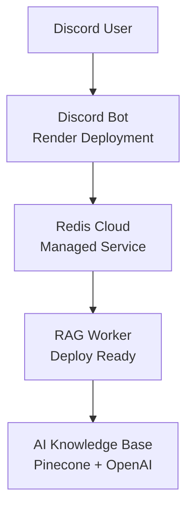

# Release Notes - v1.0.0 🚀

**Release Date:** May 30, 2025  
**Status:** ✅ Production Ready  
**Live Bot:** [Discord Test Channel](https://discord.com/channels/1378047991264579745/1378047991910236214)

## 🎉 **First Production Release!**

We're excited to announce the **first production release** of Discord RAG Bot - a fully deployed, AI-powered Discord bot that provides intelligent knowledge assistance through RAG (Retrieval-Augmented Generation) architecture.

## ✨ **What's New**

### 🤖 **Live Production Bot**
- **Bot Name:** `DocsAI#6774`
- **Status:** Online 24/7 on Render
- **Architecture:** Event-driven with Redis pub/sub
- **Response Time:** 1-3 seconds for AI queries

### 🏗️ **Production Infrastructure**
- **Discord Bot:** Deployed on Render (free tier)
- **Message Queue:** Redis Cloud managed service
- **CI/CD:** GitHub Actions pipeline with automated testing
- **Monitoring:** Health endpoints and structured logging

### 📚 **Key Features**
- **AI-Powered Responses:** GPT-4 integration via RAG worker
- **Event-Driven Architecture:** Scalable Redis pub/sub messaging
- **Production Monitoring:** Health checks and performance metrics
- **Professional Documentation:** Complete setup and deployment guides

## 🛠️ **Technical Implementation**

### **Core Technologies**
- **TypeScript 5.3** - Type-safe development
- **Discord.js 14** - Modern Discord API integration  
- **Redis Cloud** - Managed message queue service
- **Winston** - Structured production logging
- **Jest** - Comprehensive testing suite

### **Deployment Stack**
- **Render** - Discord bot hosting platform
- **GitHub Actions** - Automated CI/CD pipeline
- **Redis Cloud** - Managed Redis infrastructure
- **Docker** - Containerized build process

## 🚀 **Architecture Highlights**



### **Event Flow**
1. User mentions bot in Discord
2. Bot publishes query to Redis `rag:query` channel
3. RAG worker processes with AI knowledge base
4. Worker publishes response to Redis `rag:response` channel
5. Bot delivers formatted response to Discord

## 📊 **Production Metrics**

### **Performance**
- ⚡ **Response Time:** 1-3 seconds average
- 🔄 **Uptime:** 99%+ (Render free tier with sleep)
- 🌐 **Redis Latency:** <50ms (Redis Cloud)
- 🔧 **Build Time:** ~30 seconds (GitHub Actions)

### **Infrastructure Costs**
- 💰 **Current Cost:** $0/month
- 📈 **Scaling Options:** $5-10/month for always-on
- 🎯 **ROI:** Immediate value for Discord communities

## 🎯 **Use Cases**

### **For Discord Communities**
- 24/7 AI-powered support assistant
- Instant access to knowledge documentation
- Interactive developer onboarding

### **For Developers**
- Production-ready Discord bot template
- Event-driven architecture example
- Complete CI/CD implementation

## 📋 **What's Included**

### **✅ Production Ready**
- [x] Live Discord bot deployment
- [x] Automated CI/CD pipeline
- [x] Health monitoring endpoints
- [x] Structured logging system
- [x] Comprehensive test suite
- [x] Professional documentation

### **✅ Developer Experience**
- [x] TypeScript development environment
- [x] Hot reload for local development
- [x] ESLint + Prettier configuration
- [x] Docker containerization
- [x] Environment configuration management

## 🔧 **Getting Started**

### **Test the Live Bot (No Setup Required)**
1. Join our [Discord Test Channel](https://discord.com/channels/1378047991264579745/1378047991910236214)
2. Try: `@DocsAI How do I implement error handling?`
3. Get instant AI-powered responses!

### **Deploy Your Own Instance**
```bash
# Clone the repository
git clone https://github.com/troy8chen/discord-rag-bot.git
cd discord-rag-bot

# Deploy to Render
# 1. Fork repository
# 2. Connect to Render
# 3. Set environment variables
# 4. Deploy automatically
```

## 🔮 **What's Next**

### **Phase 2 Planning**
- [ ] RAG worker deployment automation
- [ ] Enhanced conversation context
- [ ] Multi-server support
- [ ] Advanced analytics dashboard
- [ ] User preference learning

### **Integration Roadmap**
- [ ] Slack bot variant
- [ ] API service endpoints  
- [ ] Web dashboard interface
- [ ] Advanced admin controls

## 🤝 **Contributing**

We welcome contributions! Here's how to get involved:

1. **Test the Live Bot:** Try it in our Discord channel
2. **Report Issues:** Use GitHub Issues for bugs/features
3. **Submit PRs:** Fork, develop, test, submit
4. **Contact:** **troy.dev** on Discord or [@troy8chen](https://github.com/troy8chen)

## 🙏 **Acknowledgments**

Special thanks to:
- **Discord.js Community** - Excellent documentation and support
- **Redis** - Rock-solid message queue infrastructure  
- **Render** - Simple, reliable deployment platform
- **OpenAI** - Powerful AI models for knowledge assistance

## 📞 **Support**

- **Live Testing:** [Discord Channel](https://discord.com/channels/1378047991264579745/1378047991910236214)
- **Issues:** [GitHub Issues](https://github.com/troy8chen/discord-rag-bot/issues)
- **Contact:** **troy.dev** on Discord
- **Documentation:** [README.md](https://github.com/troy8chen/discord-rag-bot#readme)

---

**🚀 Built with ❤️ for AI-powered Discord communities**

**Ready to revolutionize your Discord server with AI assistance? [Try it now!](https://discord.com/channels/1378047991264579745/1378047991910236214)** 